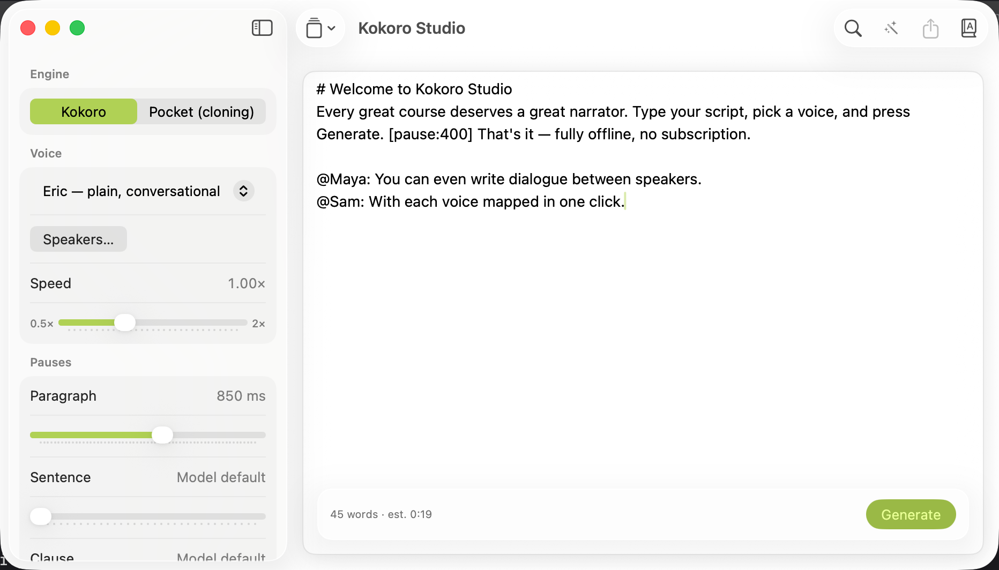

# Kokoro Studio

A fully offline macOS app for turning scripts into natural speech. Native
SwiftUI with Liquid Glass on macOS 26, powered by the
[Kokoro](https://huggingface.co/hexgrad/Kokoro-82M) TTS model and
[Pocket TTS](https://github.com/kyutai-labs/pocket-tts) voice cloning via
[sherpa-onnx](https://github.com/k2-fsa/sherpa-onnx). No Python, no network,
no subscription — one self-contained `.app`.



## Download

Grab the latest signed & notarized build from
[**Releases**](https://github.com/ntderosu-code/kokoro-studio/releases) —
unzip, drag to Applications, double-click. macOS 14+ (Apple Silicon & Intel).

## Features

**Voices**
- **Kokoro engine** — 53 voices: American & British English plus Spanish,
  French, Hindi, Italian, Japanese, Portuguese, and Chinese
- **Pocket TTS engine** — clone any voice from a 5–15 second audio sample
- Multi-speaker dialogue: tag lines `@Maya:` / `@Sam:` and map each speaker
  to a voice

**Narration control** (built for instructional content)
- Pause control by type: paragraph, sentence (`. ! ?`), clause (`, ; :`),
  and heading (`#` lines) — plus inline `[pause:800]` markers
- Pronunciation dictionary with acronym modes: respell anything, or use
  `APA = @letters`, `NASA = @word`, `IEP = @letters-first`
- Number & symbol normalization: `$5.50`, `25%`, `1–2`, `v1.2`, `x²`, `°C`
  read naturally
- Named profiles lock a whole course to one consistent sound

**Output**
- WAV (lossless) or M4A (AAC) export
- Synced **VTT/SRT captions** with sample-accurate sentence cues
- Loudness normalization: silence trim, −1 dBFS leveling, anti-click fades
- Live estimated audio length that calibrates from your actual generations

**Editor**
- Find & replace (native find bar, ⌘F / ⌥⌘F)
- Apple Intelligence **Writing Tools** in the toolbar (macOS 15.2+)
- Quick-add to dictionary: select a word, press ⌘D
- In-app playback with scrubbing

## Keyboard shortcuts

| Action | Shortcut |
|---|---|
| Generate / Re-generate | ⌘↩ |
| Export | ⌘S |
| Play / Pause | ⌘P |
| Add selection to dictionary | ⌘D |
| Find / Find & Replace | ⌘F / ⌥⌘F |

## Building from source

```bash
./scripts/fetch-deps.sh   # sherpa-onnx dylibs + both models (~500MB) into vendor/
./scripts/build-app.sh    # assembles build/Kokoro Studio.app (ad-hoc signed)
open "build/Kokoro Studio.app"
```

Run the tests (engine tests load the real models):

```bash
DYLD_LIBRARY_PATH=vendor/sherpa-onnx/lib swift test
```

Release builds (`./scripts/build-app.sh --release`) sign with Developer ID
and notarize; see the script header for the required keychain profile.

## Acknowledgements

Kokoro Studio is a thin GUI over excellent open source work:

- **[Kokoro-82M](https://huggingface.co/hexgrad/Kokoro-82M)** by hexgrad — the
  TTS model itself (Apache-2.0). The bundled `kokoro-multi-lang-v1_0` ONNX
  conversion is published by the sherpa-onnx project.
- **[Pocket TTS](https://github.com/kyutai-labs/pocket-tts)** by Kyutai — the
  voice-cloning engine (model weights CC-BY-4.0; ONNX export by
  [KevinAHM](https://huggingface.co/KevinAHM/pocket-tts-onnx)).
- **[sherpa-onnx](https://github.com/k2-fsa/sherpa-onnx)** by k2-fsa /
  next-gen Kaldi — the on-device inference runtime (Apache-2.0).
- **[ONNX Runtime](https://github.com/microsoft/onnxruntime)** by Microsoft —
  the underlying inference engine (MIT).
- **[eSpeak NG](https://github.com/espeak-ng/espeak-ng)** — phonemization data
  bundled with the model (GPL-3.0).

## License

Source code is MIT (see [LICENSE](LICENSE)). The distributed app bundles
components under their own terms — see [NOTICE.md](NOTICE.md), in particular
the eSpeak NG GPL-3.0 note for anyone forking this into a closed product.
